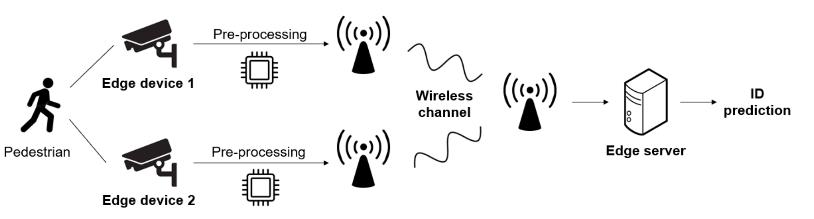
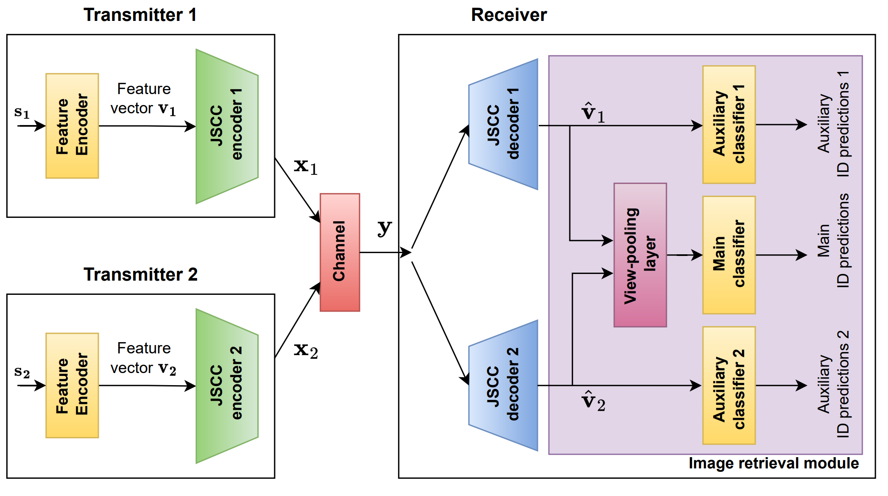
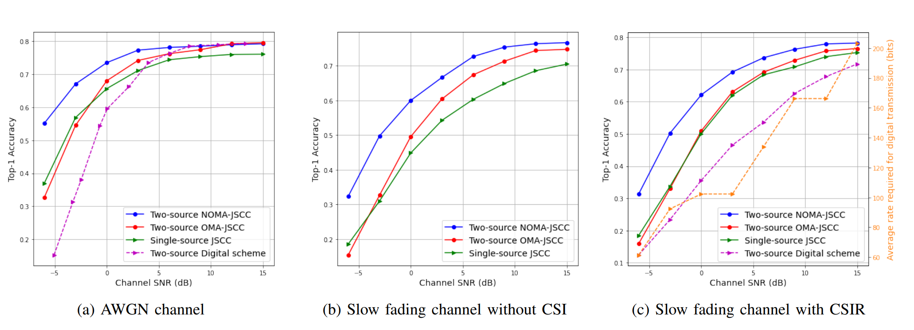

# Collaborative Semantic Communication for Edge Inference

## 摘要

这篇论文研究了在**无线边缘**进行的**协作图像检索问题**，其中多个边缘设备从不同的角度和位置捕捉相同对象的图像，然后通过共享多路访问通道（MAC）联合使用这些图像在边缘服务器上检索相似图像。我们提出了两种基于深度学习的联合源编码和信道编码（JSCC）方案，用于在加性白噪声（AWGN）和瑞利慢衰落信道上完成任务，旨在在总带宽约束下最**大化检索准确性**。所提出的方案在广泛的信道信噪比（SNR）范围内进行了评估，并表明其性能优于单设备的JSCC和基于分离的多址访问基准。我们还提出了一种具有关注模块的信道状态信息感知JSCC方案，以使我们的方法**能够适应不断变化的信道条件**。

## 一、简介 

这篇论文研究了<mark style="color:red;">**协同重新识别（ReID）问题**</mark>，在该问题中，两个边缘设备捕获相同场景的图像并与边缘服务器分布式通信，以根据图库数据库中的相似图像预测图像的身份。

<figure><figcaption>
图1：<strong>协同重新识别（ReID）问题</strong>
</figcaption></figure>

该论文提出了两种基**于深度学习的JSCC方案**。该方案用于双设备场景，在共享多址访问通道（MAC）上进行通信的同时最大化检索任务的准确性。为了探索多源协同边缘推断的不同传输方案，该论文考虑了采用分布式JSCC的**正交多址接入（OMA）方案**和**非正交多址接入（NOMA）方案，**并在加性白高斯噪声（AWGN）和瑞利慢衰落信道上评估了这些方案。

受自适应JSCC中的注意机制的启发，这篇论文还**针对AWGN信道**提出了一种**SNR感知方案**，**以根据SNR调整网络**。论文的主要贡献可以总结如下：

1. &#x20;这是首篇研究边缘设备之间联合检索的协同推断论文。提出了两种新的协同JSCC方案，用于OMA和NOMA传输，并显示了后者的优越性。
2. 构建和分析了用于通道状态信息（CSI）感知的JSCC方案（SNR感知和信道衰落感知）的DNN体系结构，其中单一网络被训练以利用通道状态信息进行信道均衡和SNR自适应。

## 二、相关工作

### A. 图像检索&#x20;

**图像检索任务**旨在提高身份识别的质量。给定一个查询图像，图像检索模型评估其与图库图像的相似性，并将其与“最近”的图像匹配。性能可以通过 **top-1 检索准确性**来评估。

### B. 无线边缘的远程推断&#x20;

统通信系统设计用于提供数据包，而不考虑数据包的内容或接收方的任务。因此，在新兴的语义通信范式的背景下，远程推断问题引起了极大的兴趣。关于**联合边缘设备推断**的文献**主要关注速率受限的场景，而忽略了信道效应**。Jankowski等人提出了一种用于图像检索的JSCC传输方案，与之前基于数字方案的工作相比有了显着的改进。

### C. 多设备协同学习&#x20;

现有的**多设备协同算法**主要侧重于信号传输、分类任务、视觉问题回答和多智能体协调。 **Shao等人提出了一种用于分布式特征编码的**<mark style="color:red;">**确定性分布式信息瓶颈**</mark>**（DDIB）原则**。 与以往的工作不同，这篇的论文研究了在无线边缘上的协同推断，**考虑了无线信道的影响**。

## 三、系统模型

考虑两个发射器，每个发射器都可以访问由不同摄像机拍摄的相同物体的图像。我们使用

$$
s_i \in \mathbb{R}^p
$$

来表示发射器 i 观察到的图像。其中 i = 1, 2。发射器 i 采用编码函数

$$
E_i：x_i = E_i(s_i) \in \mathbb{C}^q
$$

并且 x\_i受到功率约束的限制：

$$
\frac{1}{q} ||x_i||_2^2 \leq 1
$$

这里，q 代表可用的信道带宽。接收器处使用解码器函数

$$
D: \mathbb{C}^q \rightarrow \mathbb{D}
$$

其中 D≡{1,2,…,D}, D 是数据库的大小，将接收到的信号 y 映射到检索任务的结果。

### **信道模型**

设备通过**多址访问信道**传输它们的信号。接收到的信号由y = h₁x₁ + h₂x₂ + z给出，其中z ∈ ℂ^q是加性噪声向量。对于AWGN信道，我们设置h₁ = h₂ = 1。我们还考虑了一个慢衰落的多址访问信道，其中衰落系数h₁和h₂ ∈ ℂ，假定在每个检索任务期间保持恒定，但在i.i.d.的方式下从CN（0，σ²h）中采样的方式会在任务之间发生变化。 我们将考虑并比较三种备选传输方案，包括基于分离的传输、OMA的JSCC和NOMA的JSCC，以及单用户基准\[5]。

### A. 分离数字传输&#x20;

在数字方案中，发射器Ei从源si中提取语义特征向量vi ∈ ℝ^r，然后将其量化为v˜i ∈ ℤ^r，并映射到信道码字xi ∈ ℂ^q。两个发射器通过多址访问信道传输它们的码字。

接收器首先解码两个信道码字以恢复量化的语义特征v˜1和v˜2。在无限块长度的渐近极限情况下，如果传输速率在相应信道的容量范围内，发送的码字可以被解码，且错误概率会减小到零。在这种情况下，计算所需函数的唯一错误源是量化。然后，接收器对恢复的源信号执行检索任务。

### B. JSCC&#x20;

在这个方案中，源信号si ∈ ℝ^p，i = 1, 2，首先被映射到语义特征向量vi ∈ ℝ^r，i = 1, 2，然后再映射到信道码字xi ∈ ℂ^q。

我们考虑两种JSCC方案：&#x20;

1. JSCC与OMA：每个发射器分配了可用信道带宽的一半，即q/2个信道使用。&#x20;
2. JSCC与NOMA：在这个方案中，每个发射器占用了完整的信道带宽q。&#x20;

在两种情况下，接收器首先解码接收到的信号，使用两个JSCC解码器Di：C^q → ℝ^r，i = 1, 2，来恢复语义特征的估计vˆ1和vˆ2，然后使用恢复的语义特征执行检索任务。

## 四、分布式图像检索

在本节中，我们关注图像检索任务，该任务通过**top-1检索准确性**进行评估。&#x20;

### A. 分离数字传输&#x20;

每个发射器由一个语义特征编码器组成，建模为一个**ResNet50 网络**，然后是一个**特征压缩器**，采用**量化和算术编码模块**，这些模块与\[5]中的最新流程相同。然后，压缩的比特被信道编码并传输到无线信道上。接收器解码接收到的信号以获得量化语义特征的估计值，然后将其传递给图像检索模块。&#x20;

**训练策略**：我们对数字方案进行端到端的训练，使用以下损失函数：

$$
l = \frac{1}{3}(l_{ceaux1} + l_{cemain} + l_{ceaux2}) + \lambda \cdot (\log_2 p(v^\sim_1) + \log_2 p(v^\sim_2))
$$

其中l\_ceaux1，l\_ceaux2，l\_cemain是每个分类器（两个辅助分类器和一个主分类器，参见图2）的**身份预测结果与实际结果之间的交叉熵损失**，与\[5]相同。log2 p(v˜1)和log2 p(v˜2)是**量化语义特征的熵**。

<figure><figcaption>
图2
</figcaption></figure>


注：文献\[5]是“M. Jankowski, D. Gund ¨ uz, and K. Mikolajczyk, “Wireless image re- ¨ trieval at the edge,” IEEE Journal on Selected Areas in Communications, vol. 39, no. 1, pp. 89–100, 2021.”


### B. JSCC&#x20;

在这个方案中（如图2所示），发射器端的**特征压缩器**、**量化器**、**算术编码器**和**信道编码器**以及接收器端的**信道解码器**和**算术解码器**都被替换为<mark style="color:red;">**单一的自编码器架构**</mark>。接收到的信号被送入两个联合的语义-JSCC解码器，这些解码器解码两个发射器发送的语义特征的估计值。一旦语义特征被恢复，它们就被用于图像检索任务。&#x20;

**训练策略**：采用了三步训练策略，包括：

1. 语义特征编码器的预训练（T1）;
2. JSCC自编码器的预训练（T2）;
3. 端到端训练（T3）。

在T1中，语义特征编码器进行预训练，使用平均交叉熵损失函数：

$$
l_{cls} = \frac{1}{3}(l_{ceaux1} + l_{cemain} + l_{ceaux2})
$$

在T2中，**已预训练的语义特征编码器被冻结，只训练JSCC自编码器**，使用传输和重建语义特征之间的平均均方误差（MSE）损失：

$$
l_{jscc} = \frac{1}{2}(l_{MSE1} + l_{MSE2})
$$

，其中l\_{MSEi}，i = 1, 2 是第i个发射器传输特征vi和重建语义特征(\hat{v}\_i)之间的**均方误差**。

在T3中，使用T1中的损失函数对整个网络联合训练。&#x20;

这篇论文还提出了一种针对AWGN和只在接收端具有**CSI（信道状态信息）**的慢衰落信道的CSI感知架构变体，其中可用的CSI（信噪比或信道增益）通过**注意力特征（AF）模块**\[10]，\[12]传送到模型中，在自编码器的每一层之前、之后和之间插入。对于AWGN信道，编码器和解码器的AF模块会调整中间特征图，以适应信道的信噪比。对于具有CSIR的慢衰落信道，AF模块通过信道相关的常数来调整接收信号和中间特征图，**直观地起到信道均衡的作用**。

## 五、实验结果

### A. 针对信道信噪比的性能

&#x20;我们提出的JSCC与OMA和NOMA方案在经过预处理的**Market-1501 \[22]数据集**上经过范围从-6dB到15dB的信道信噪比（SNR）的训练和测试，并与基于分离的方案以及\[5]中的单设备JSCC方案进行比较。&#x20;

在图3a中，我们绘制了AWGN信道中的top-1准确性。在图3b中，我们绘制了在无接收端CSI的慢衰落信道中的top-1准确性。数字方案没有在图3b中绘制，因为在没有接收端CSI的情况下无法解码这种方案，而JSCC允许在没有接收端CSI的情况下进行通信。在图3c中，我们绘制了在接收端具有CSI的慢衰落信道中的top-1准确性。正如预期的那样，CSIR提供了比接收端缺少CSI时更好的准确性。 在图3a、3b和3c中，提出的JSCC方案在几乎所有的SNR下表现优于分离数字方案，除了在高SNR下。然而，需要注意的是，在这种分离数字方案中，我们假设使用MAC容量达到的编码，并且对每个发射器进行均等速率分配，因此数字方案的性能在实践中是不可达到的，尤其是在考虑到这里的每个用户的非常低信道带宽q = 32的情况下。两个设备的JSCC方案在广泛的信道SNR范围内，特别是在较高SNR下，都优于单设备的JSCC方案，显示了在边缘服务器上合并同一身份的两个视图以进行协作决策有助于提高检索性能。还可以观察到，在图3a、3b和3c中，NOMA JSCC方案优于其正交对应方案。在图3a中，OMA JSCC方案虽然在大多数SNR下优于单设备JSCC基准，但在非常低的SNR下却被超越。这是因为在低SNR范围内，将所有信道资源分配给一个发射器以获取足够质量的特征进行检索更有益，而不是从两个查询接收非常低质量的特征。然而，NOMA JSCC方案将两种方案的优点结合在一起，在所有SNR下都优于两种方案。在图3c中，单设备JSCC以及提出的两设备JSCC方案（包括OMA和NOMA）都优于基于分离的方案。这些观察结果与我们的预期相符。数字传输方案中使用的分离源和信道编码的次优性源自两个原因。其中之一是在有限块长度情况下分离性的通常次优性。这已经在\[5]中针对点对点场景进行了观察。另一方面，在无限块长度情况下，当通过MAC传输的两个源相关时，分离变得次优。已知利用源之间的相关性生成编码器处的相关码字可以严格提高端到端性能\[23]，\[24]。为了允许在分布式发射器之间进行部分协作，必须允许传输信号在统计上依赖于源输出，从而在传输信号之间引入相关性。分离性方案以相反的方式运作，其中分离的源和信道编码破坏了源之间的依赖关系，从而使传输信号独立。

<figure><figcaption>
图3
</figcaption></figure>
