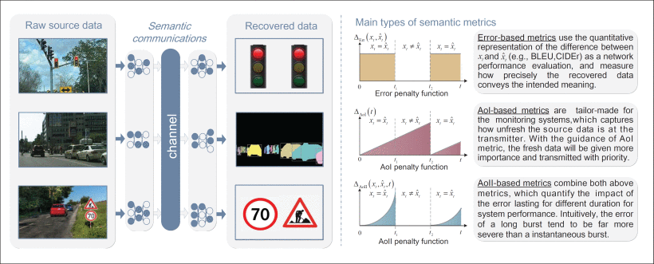

# Semantic Communication Meets Edge Intelligence

## 引言

&#x20;随着信息和通信技术（ICT）与人工智能（AI）的不断融合，“物联网”被视为6G愿景的关键之一，其中语义通信（SemCom）和边缘智能被认为是两个关键的推动因素\[1]。

**SemCom被广泛认为是突破“**[<mark style="color:red;">**香农陷阱**</mark>](#user-content-fn-1)[^1]**”的一种有前途的通信范式**。实际上，SemCom并不是一个全新的概念。在香农定理引入后不久，韦弗（Weaver）和香农（Shannon）进一步确定了通信这一广泛主题中的三个问题层次\[2]：

**技术层次**：通信符号能够准确传输吗？

**语义层次**：传输的符号有多准确地传达所需的含义？

**有效性层次**：接收到的含义对所需方式的行为产生多大效果？

香农的经典信息理论（CIT）\[3]仅关注技术层次，并成功地基于概率模型推导出了严格的通信数学理论，其中信息被定义为能够消除不确定性并根据给定源的发生概率进行量化的内容。

然而，**在CIT驱动的传统通信系统中实现的传输速率接近香农极限**，并且可用的频谱资源越来越稀缺。此外，新兴应用的快速发展，例如自主交通系统，导致移动数据流量不断增长。在这方面，SemCom重新变得重要。在人工智能技术（如计算机视觉（CV）和自然语言处理（NLP））的支持下，端设备（如传感器节点或智能手机）最终可能具备类似于人类推理的能力。因此，语义提取（SE）可以集成到通信模型中以实现SemCom。因此，SemCom允许只将接收者感兴趣的信息传输，而不是原始数据。因此，可以大大减少带宽消耗，并通过避免交换整个数据来增强隐私保护。然而，仍然存在一些阻碍SemCom实施的因素。例如，**SE模型的训练过程需要大量的计算和存储资源，从而阻碍了在资源受限的端设备上可扩展实施SemCom。**此外，在构建通向改进SE模型泛化能力的共同知识库时，可能会出现隐私丧失等其他问题。

幸运的是，边缘智能有望促进SemCom系统的可扩展实施。边缘智能的前身是边缘计算，它将服务特定的处理和数据存储从中央云移动到接近数据源的网络边缘。在5G网络中，边缘计算已经在改善性能、支持新服务和功能方面取得了显著成就。在6G中，借助AI技术，边缘智能旨在在边缘网络中提供更强大的计算处理和大规模数据获取，以实现动态和自适应的边缘维护和管理\[4]。因此，边缘智能可以为SE模型的训练和知识存储提供良好基础。

另一方面，为了实现普遍AI的6G愿景，分布式学习和推理已经成为推动边缘网络智能化的重要手段\[5]。然而，数据驱动方法意味着启用AI的代理必须承担昂贵的通信和计算开销，这对通信网络提出了挑战，特别是在不确定的无线环境和有限的无线资源中。在这方面，SemCom可以被看作是边缘智能的关键推动因素。

***

本文的贡献如下：

1. 我们引入了SemCom的一般系统模型，涉及香农和韦弗预见的三个通信层次。然后，我们讨论了典型的语义度量和关键的SE技术。
2. 为了解决训练、维护和执行SemCom的SE模型的昂贵实施开销，我们通过研究联邦学习（FL）启用的SE系统模型和边缘共享知识图引入了边缘启用的SemCom。我们还介绍了SemCom在培训智能代理和增强通信高效分布式机器学习（ML）中的作用。
3. 我们深入讨论了在AI和通信交叉点上朝向SemCom的未解决问题和未来研究方向，这是6G网络的关键组成部分。
4. 我们提供了一个在无线供电的物联网中进行语义感知资源分配的案例研究。与以CIT驱动的IoT不同，我们的研究<mark style="color:red;">**利用了AI驱动的分配机制**</mark>，制定了最大化网络中语义性能的资源分配策略。

## 前提条件

SemCom与传统的香农通信不同之处在于，它在通信数据的编码和解码中融入了类似人类的“理解”和“推理”的特性，不再追求精确的数据复制。在本节中，我们简要介绍SemCom框架和**典型语义度量**，并讨论现有工作中的关键SE技术。

### SemCom框架

与盲目传统的经典通信系统不同，SemCom设计中重要的是语义内容的准确性，而不是与可能由源发出的源数据的可能性相关的平均信息\[6]。因此，SemCom系统的主要变化在于发送前和接收后的数据处理（图1）。在编码之前，源数据经过语义表示模块，可以看作是“传输前的理解”过程，其中去除了多余的信息。然后，提取的相关信息进入语义编码模块。在一般的SemCom场景中，语义解码是编码的逆过程，这是基于AI技术和它们的先验知识共同确定的。为简便起见，我们将语义编码和解码都称为SE，并且在后续文本中，语义编码（解码）被视为与语义表示（解释）模块集成在一起。

与人类对话一样，有效的对话需要双方共同了解彼此的语言和通信背景。在SemCom中，**通信各方的**<mark style="color:red;">**背景知识（BK）**</mark>**必须实时共享**，以确保对所有源数据的理解和推理过程能够良好匹配。如果BK未能匹配，将产生语义噪声，即使在物理传输过程中没有句法错误的情况下，也会导致性能下降。

此外，在一些通信目标可能发生变化的情况下，所有通信目标的可能性都应包含在BK中，并且通信目标应指导SE在每次传输中过滤掉不相关的语义信息（SI）。

语义度量 网络性能度量的设计长期以来一直是网络设计和优化的核心关注点。由于SemCom的研究仍处于早期阶段，大多数语义度量都是从自然语言处理（NLP）中衍生的（表1）。与经典通信系统中的比特错误率（BER）或符号错误率（SER）不同，SemCom避免平等对待数据包，并测量恢复的句子与传输的句子所传达的含义之间的差异。除了这些基于错误的度量之外，还有一些其他度量关注及时性。基于信息时代（<mark style="color:red;">**AoI**</mark>）的度量突出了数据包新鲜度的重要性，这允许基于AoI最小化的调度方案在带宽约束的情况下过滤掉不相关的数据包。通过综合考虑信息的准确性和及时性，\[9]中的作者引入了错误信息时代（AoII）的度量到SemCom中，通过审视数据包在实现整体通信目标中的作用来衡量网络性能。

***

此外，对于一些数据包的传输受到系统目标评估重要性的情况，<mark style="color:red;">**信息价值（VoI）**</mark>比准确性更受关注。因此，VoI相关的度量可以用于目标导向的通信，捕捉数据包的重要性、相关性和优先级。图2中呈现了一些SemCom示例和三种典型类型的度量。

<figure><figcaption></figcaption></figure>

语义提取技术 我们现在讨论一些关键的SE技术，其一般模型如图3所示。

<figure><figcaption></figcaption></figure>

基于深度学习的SE&#x20;

随着Transformer、squeeze-and-excitation网络和深度残差网络的进步，深度学习（DL）已经被广泛应用于文本、语音和图像传输的SE。**DL-based SE旨在在低信噪比（SNR）下提高系统的稳健性，同时保持更短的比特流。**编码器和解码器通常被建模为两个分别可学习的部分，并通过一个随机通道连接，它们被<mark style="color:red;">**联合训练**</mark>\[10]。在训练过程中，通常使用生成对抗网络（GANs）来模拟通道动态和噪声。然而，由于损失函数通常需要是可微的，因此在模型训练过程中采用了常见的损失函数，如交叉熵。这使得对数据的语义贡献平等对待，与人类感知不一致。

基于深度强化学习的SE&#x20;

深度强化学习（DRL）可以将诸如BLEU等不可微的语义度量整合到SE训练中。在\[8]中，DRL-based SE用于文本传输，使用长短时记忆网络作为编码器和解码器。状态被定义为解码器和先前生成的单词的循环状态。两个相邻状态之间的转换由下一个生成的单词确定，DRL代理的动作是生成一个新单词，其动作空间由词典维度定义。由于语义度量只能用作DRL中的长期回报，因此采用自批评训练来解决识别中间奖励的具有挑战性的问题，即每个步骤对整个句子语义的影响。此外，对于其他非顺序任务，解码过程需要事先转换为一个循环过程。

知识库辅助SE&#x20;

知识库（KB）是用于知识管理的特殊数据库，广泛应用于自动化人工智能系统中，用于存储具有形式化表示以进行推理的数据。<mark style="color:red;">**KB辅助**</mark>SE将KB整合到编码器和解码器中，旨在提**取与给定传输比特限制的通信任务相关的更多**[<mark style="color:red;">**SI**</mark>](#user-content-fn-2)[^2]\[7]。具体而言，Semcom中的KB由源信息、通信任务以及通信参与者能够理解、识别和学习的推理可能性组成。在SE过程中，KB用于量化不同通信任务的SI相关性水平，并指导SE在每次传输中捕捉与任务密切相关的SI。同时，由于KB辅助SE是端到端的，因此双方的KB需要保持同步。

语义本地SE&#x20;

在前述方法中，SI是固定的。在\[11]中，作者提出了一种语义本地SE，其中SI可以从智能代理之间的迭代通信中学习，这使得在SI随时间变化的情况下变得可行。此外，通信各方可以具备关于社交互动的本地上下文中语义的情境推理能力，使得通信更加高效。因此，它可以促进具有高度灵活性和效率的通信系统的智能化。

## 启用边缘的SemCom

与经典的“先传输后理解”通信相比，SemCom的“理解先于传输”范式需要共享的知识背景和计算密集型的SE模型训练和推理操作。这无疑带来了新的挑战，总结如下：

1. 终端设备的**有限计算能力**和**能量约束**导致SE模型的训练和更新时间长，从而降低了通信的可靠性。
2. 为了提高SE模型，终端设备之间进行**全面的知识共享会耗费带宽和牺牲隐私**。另一方面，**不完整的知识会降低基于AI的SE的泛化能力**。
3. 大多数SE方法是任务特定的，被分开训练，这远离了类似大脑认知的目标，由于工作的重复而计算效率低下。

为了解决上述挑战，我们在本节提出了一种边缘启用的SemCom架构。

[**联邦学习**](#user-content-fn-3)[^3]**启用的SE**&#x20;

我们通过将边缘智能与SemCom集成来解决前两个挑战。鉴于边缘服务器具有强大的计算和缓存能力，可以**在边缘进行BK存储和SE模型训练**。这样，**可以减少训练的计算和通信延迟**（第一个挑战中提到的）。与此同时，**边缘服务器可以作为知识共享的权威中介，从而消除了所有通信方必须完全共享彼此BK的需要\[7]**。这可以减**轻通信方的负担，并增强他们的隐私**。

尽管KG的构建也是一个计算密集型的任务，但KG的结构比为各种任务重新训练单独的SE模型更为固定。

我们考虑一个常见的城市场景，如图4a所示。

<figure><figcaption></figcaption></figure>

终端设备通常根据其关联的接入点或传输要求被聚类成不同的组。然后，边缘服务器进行SE模型训练，终端设备使用训练有素的模型执行SE。通过FL，边缘服务器中训练有素的SE模型参数可以直接与具有相同任务的其他边缘服务器交换，以加速训练过程。因此，可以以保护隐私的方式提高模型的泛化性能。关键步骤概述如下：

1. 边缘服务器根据每个通信组共享的BK执行特定SE任务的预训练或微调。在具有相同通信目标但没有共享知识背景的**不同通信组之间执行**<mark style="color:red;">**模型参数交换**</mark>**和联邦聚合**。（边缘服务器）
2. 派生的全局模型分别广播到每个通信组。（接入点）
3. 源设备生成原始数据。目标设备接收SI。然后，使用SE模型对SI进行编码和解码。（终端设备）
4. 目标设备在通信过程中评估SI的准确性以进行数据标记。（终端设备）
5. 新标记的SI和/或相应的原始数据上传到边缘服务器。（接入点）
6. 边缘服务器根据上传的信息和原始数据**执行知识集的定期更新**，以微调SE模型。（边缘服务器）

基于边缘共享知识图的高效语义提取&#x20;

在这一小节中，我们关注第三个挑战。受KB辅助SE的启发\[7]，我们提出构建一个边缘共享的知识图（KG），该图存储通信目标和SI之间的底层关系，以实现计算效率高的SE。

一般来说，复杂的KG严重依赖于一个

大型深度学习模型和一个完整的知识集。幸运的是，在边缘智能的框架中，KG可以被缓存在边缘服务器上，可以以较短的链路距离访问可用的相关知识集。尽管KG的构建也是一个计算密集型的任务，但KG的结构比为各种任务重新训练单独的SE模型更为固定。一旦建立了KG，它可以被缓存在边缘服务器上，以促进计算高效的SE。

以智能交通网络中的SemCom为例，我们考虑了KG的用例。由于针对多个对象的多对象识别的训练有素的卷积神经网络（CNN）嵌入了与不同对象相关的所有特征映射，因此CNN的输出对特征映射的梯度可以被视为特征映射对不同对象的重要性权重\[7]。因此，KG可以通过存储不同识别目标任务的所有特征映射的重要性权重来建立\[7]。在这种情况下，可以根据重要的特征映射执行对单个对象识别的SE，从而避免了专门培训的需求，并使图像更有效地传输。同时，尽管自动驾驶车辆和无人机在不同的环境中工作并具有独特的任务规格，但它们也共享一些相似的特征和通信目标，例如避免碰撞和路径规划。因此，可以应用KG和迁移学习技术（用于初始化SE模型参数）来训练SE，以节省车辆和无人机的计算资源。

研究方向

虽然上述网络架构有助于高效SemCom的发展，但在实际实施之前仍然有一些需要解决的问题，以下是其中的一些亮点。

1. SE的可解释性和可解释性： 由于通信中经常出现意外信息，SE方法的黑盒性质阻碍了其实施。因此，需要研究SE中的可解释性，以关联可能的原因和结果，并指导对SE模型的改进。与此同时，SE中的可解释性可以识别深度网络中隐藏的SI，为上述基于KG的跨多模态和任务的高效SE铺平道路。然而，大多数现有的SE方法都不具备可解释性。
2. 基于语义噪声的隐私保护： 对于具有相似BK和通信目标的通信组，窃听变得很容易。考虑到隐蔽通信的成功，其中引入人工噪声以进行安全的无线传输，人为增加不匹配以生成语义噪声可能也是一种潜在的方法，以实现安全的SemCom。
3. 可变长度语义编码： 现有的研究仅考虑SE中动态信道增益，而忽略了资源约束的问题。然而，在多用户场景中，资源的波动，如可用频谱和发送功率，可能对SemCom的性能产生重要影响。如何实现可变长度的语义编码以应对动态网络资源仍然是一个未解决的问题。

[^1]: <mark style="color:orange;">\[香农陷阱是指在信息传输中，尤其是在传统的通信系统中，由于技术层次的限制，信息传输的效率逐渐受到困扰和制约的现象。具体而言，香农陷阱是指在信息传输中，技术层次（即信息的准确传输）已经接近极限，难以进一步提高传输速率，而在语义层次（即传输的符号如何精确地传达所需的含义）和有效性层次（即接收到的含义对所需方式的行为产生多大效果）方面仍存在提升的空间。这导致了在传统通信系统中信息传输效率的瓶颈，即“香农陷阱”。 SemCom的目标之一就是突破这一陷阱，通过引入语义通信和边缘智能等技术，提高信息传输的效率和精确性。]</mark>

[^2]: SI指的是“语义信息”，在上下文中是指语义通信中的信息。在语义通信中，SI包括源数据中与通信任务相关的具体语义内容。 SI的提取和处理对于语义通信系统的设计和性能至关重要。

[^3]: 联邦学习是一种机器学习的分散式学习方法，其基本思想是在不共享原始数据的情况下，多个参与方共同训练一个模型。在联邦学习中，模型的训练过程分布在多个本地设备（例如终端设备、边缘设备）上进行，而模型的参数更新通过通信进行协调。

    具体来说，联邦学习的过程如下：

    1. **初始化：** 一个全局模型在中心服务器上初始化。
    2. **本地训练：** 每个本地设备使用本地数据对全局模型进行训练。由于数据不离开设备，隐私得到了保护。
    3. **模型更新：** 在本地训练结束后，本地设备将本地训练得到的模型参数的更新上传至中心服务器。
    4. **全局协调：** 中心服务器收到所有本地设备上传的模型参数更新后，进行全局协调，通过整合这些更新来更新全局模型。
    5. **迭代：** 上述步骤迭代进行，直到全局模型收敛或达到预定的迭代次数。

    联邦学习的优势在于保护了参与方的隐私，因为原始数据不离开本地设备，只有模型参数的更新通过安全通信传输。这种分散式的学习方式特别适用于大规模、分布式、隐私敏感的数据场景，例如智能手机上的个人数据、边缘设备上的传感器数据等。
